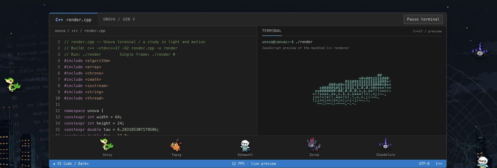
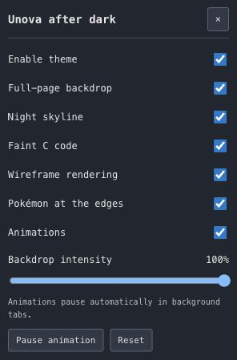

# Canvas-Theme

A personal, presentation-only Chrome extension for the **MyUSF Canvas dashboard**. Combines VS Code Dark+ styling with an Unova-inspired night skyline, animated Generation V Pokémon, faint background code/wireframe motion, and a C++ / ASCII terminal workbench at the top.

## Current appearance

Actual screenshots of version 1.2.0 running in Canvas, cropped to theme-only areas. Course information, grades, names, avatars, and browser chrome are excluded; these are not mockups.

### Top terminal and surrounding backdrop



### Appearance controls



The images capture individual animation frames. See [screenshot notes](docs/screenshots/README.md) for capture scope and privacy details.

## Install

1. Clone or download this private repository and extract it if necessary.
2. In Chrome, open `chrome://extensions` and enable **Developer mode**.
3. Choose **Load unpacked** and select the **`extension/` directory**, not the repository root.
4. Refresh [MyUSF Canvas](https://usflearn.instructure.com/) and scroll to the top.

No local web server, npm install, or build is required to use the extension. Keep its folder in place after loading it. If you already use another copy, disable that older extension before loading this one. See [installation and updates](docs/INSTALLATION.md).

## Features

- Dark Canvas panels and VS Code-style accents.
- Full-window Unova-inspired skyline with Snivy, Tepig, Oshawott, Zorua, and Chandelure around the margins.
- Faint C code and a rotating wireframe behind the native dashboard.
- Top workbench with a complete 101-line C++ listing, animated ASCII torus, original Pokémon strip, and blue status bar.
- Independent layer controls and a terminal-only pause button.
- Local preferences, real GIF pause using static PNG counterparts, reduced-motion support, and hidden-tab suspension.

The terminal is a JavaScript visualization of the bundled C++ program, **not a real shell or browser C++ compiler**. The theme does not edit coursework or submit academic actions.

## Project structure

```text
Canvas-Theme/
├── extension/          # Load this folder in Chrome; no build needed
│   ├── manifest.json
│   ├── content.js      # Fixed backdrop and theme controls
│   ├── terminal.js     # Independent top C++/ASCII panel
│   ├── *.css           # Dashboard and shadow-root styles
│   ├── render.c        # Standalone C example
│   ├── render.cpp      # Standalone C++ example
│   └── assets/         # Bundled skyline, GIFs, static PNGs
├── docs/               # Installation, architecture, privacy, asset credits
├── tests/              # Synthetic DOM and renderer regression checks
├── scripts/            # Validation, test runner, clean ZIP packaging
└── .github/workflows/  # Automated checks
```

## Development

Use Node.js 24+, npm, and C/C++17 compilers (`cc` and `c++`, or `CC` / `CXX`).

```sh
npm ci --ignore-scripts
npm run check
npm test
npm run package
```

The package command also requires `zip` and writes `dist/canvas-theme-1.2.0.zip`, containing only the loadable extension. Tests compile the renderers in a temporary directory and use synthetic dashboard markup, not student data. No runtime npm dependencies are shipped.

## Scope, privacy, and status

The extension runs only on the top-level dashboard paths `/`, `/dashboard`, and `/dashboard/` at `usflearn.instructure.com`. Course, assignment, quiz, login, and inbox pages are excluded. The only requested permission is `storage`; assets are bundled locally. See [privacy and boundaries](docs/PRIVACY.md).

Version 1.2.0 has 24 passing DOM-simulation check groups; 49 ASCII frames match the compiled C++ output. The desktop top panel and settings have now been observed in live Canvas, as shown above. Full-dashboard interaction and mobile/responsive QA remain incomplete. See [verification notes](docs/VERIFICATION.md).

This is a private, unofficial personal project, not affiliated with USF, Instructure, Microsoft, or Pokémon's rights holders. No open-source license is granted. Third-party character artwork remains subject to its owners' rights; see [asset provenance](docs/ASSETS.md).
